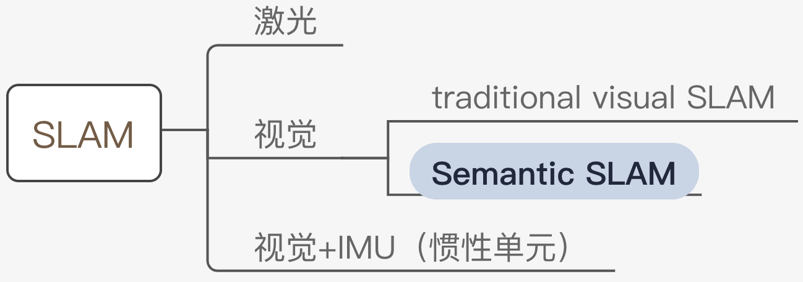
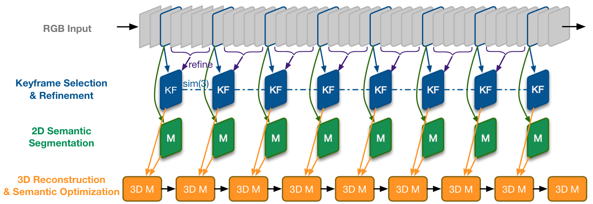

# Semantic & Reinforcement SLAM 领域调研

[TOC]

## Semantic SLAM
### 简介
​	至今为止，主流的 SLAM 方案 [[1]](http://webdiis.unizar.es/~raulmur/orbslam/) 都是基于处于像素层级的**特征点**，更具体地，它们往往只能用**角点或边缘**来提取路标。人类**是通过物体**在图像中的运动来推测相机的运动，而**非特定像素点**。

​	Semantic SLAM 是研究者试图利用物体信息的方案，其在Deep Learning的推动下有了较大的发展，成为了相对独立的分支，就方法（非设备）而言，其在整个SLAM领域所处位置如下图：

​	目前而言，所谓 **Semantic** 是将基于神经网络的**语义分割、目标检测、实例分割等技术**用于 SLAM 中，多用于特征点选取、相机位姿估计，更广泛地说，端到端的图像到位姿、从分割结果建标记点云、场景识别、提特征、做回环检测等**使用了神经网络的方法**都可称为 Semantic SLAM [[2]](https://zhuanlan.zhihu.com/p/58648284)。

​	语义和 SLAM 的结合的体现有以下两点 [[3]](https://book.douban.com/subject/27028215/)：

- SLAM 帮助语义。

  检测和分割任务都需要大量的训练数据，在 SLAM 中，由于我们可以估计相机的运动，那么各个物体在图像中位置的变化也可以被预测出来，**产生大量的新数据为语义任务提供更多优化条件**，且节省人工标定的成本。

- 语义帮助 SLAM。

  一方面，语义分割把运动过程中的每一张图片都带上物体标签，随后传统 SLAM 将带标签的像素映射到3D空间中，就能得到一个带有标签的地图。

  另一方面，语义信息亦可为回环检测、Bundle Adjustment 优化带来更多的条件，提高定位精度。

  仅实现前者的工作往往称为 **Semantic Mapping**，后者才认为是完整的 Semantic SLAM。

### 发展

介绍 2016 - 2019 年一些典型工作。

#### Semantic Mapping

这类工作要求特征点是 **dense 或 semi-dense** 的（否则 Mapping 无意义），因此往往用 RGB-D 的 SLAM 方案，亦或是单目相机的 semi-dense LSD-SLAM 方案 [[4]](https://vision.in.tum.de/research/vslam/lsdslam)。

有两种 Mapping 方式：

1. 将2D图像的语义分割结果，即**带标签的像素，映射到3D点云中**。

   研究人员尝试让 SLAM 所得的信息（特别是相机位姿），能够提高语义分割的性能。其中一种是使用 SemanticFusion [[5\]](https://arxiv.org/abs/1609.05130) 的 Recursive Bayes 方法：根据 SLAM 对像素点运动的估计，当前帧的**像素的语义分类概率** 与 前一帧**旧位置上的分类概率**相乘作为最终概率，即像素的概率会沿着各帧累乘，因而增强语义分割的结果。

   这一方法被基于单目相机的工作 [[6\]](https://arxiv.org/abs/1611.04144) 沿用，整体框架描述如下。

   

   >  LSD-SLAM + DeepLab-v2 （语义分割）
   >
   > 流程：输入 -> 选关键帧并 refine（非关键帧用于增强深度估计）-> 2D语义分割 -> 语义优化+3D重建 
   > ① 为保证速度，仅对关键帧来进行语义分割，
   > ② 其他帧用 small-baseline stereo comparisons [[7]](https://ieeexplore.ieee.org/document/6751290) 对关键帧做深度估计的优化
   > ③ **使用 Recursive Bayes 增强语义分割**
   > ④ 3D重建的优化使用条件随机场（CRF），同 SemanticFusion

2. 以Object为单位构建地图

   

   

#### Real Semantic Mapping

此部分为本文的重点

| Year | Semantic Mapping |                        Semantic SLAM                         |
| ---: | :--------------: | :----------------------------------------------------------: |
| 2016 |                  | 将语义部分加入 Bundle Adjustment (BA) 的优化公式中：① Joint Detection, Tracking and Mapping by Semantic Bundle Adjustment ②Improving Constrained Bundle Adjustment Through Semantic Scene Labeling（3）Semantic segmentation–aided visual odometry for urban autonomous driving |
|      |                  |                                                              |
| 2017 |                  |       Probabilistic Data Association for Semantic SLAM       |
| 2018 |                  |                                                              |
| 2019 |                  |      A Unified Framework for slam and semantic (ICRA19)      |

## Reinforcement SLAM