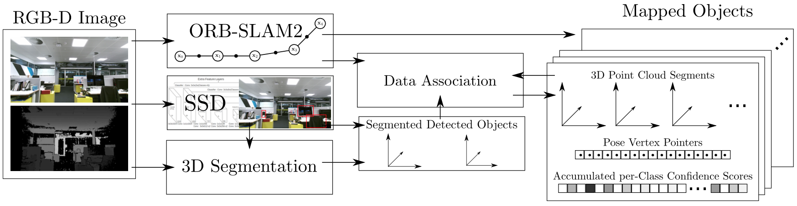
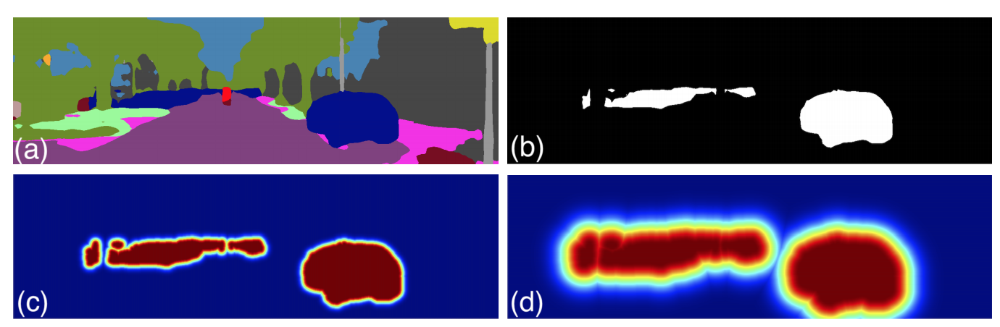
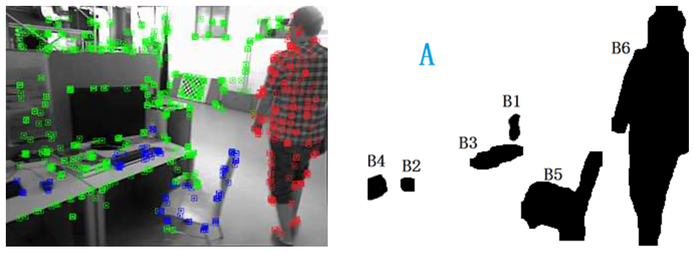
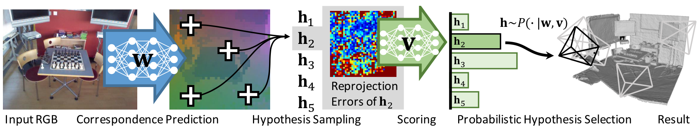

# Semantic & Reinforcement SLAM Review

**语义 SLAM** 和 **基于强化学习的 SLAM**

本文企图概括这两个方向的工作，长期更新，但因水平有限，若有错漏，感谢指正。

[TOC]

## Semantic SLAM
### 简介
至今为止，主流的 SLAM 方案 [[1]](http://webdiis.unizar.es/~raulmur/orbslam/) 都是基于处于像素层级的**特征点**，更具体地，它们往往只能用**角点或边缘**来提取路标。人类**是通过物体**在图像中的运动来推测相机的运动，而**非特定像素点**。

Semantic SLAM 是研究者试图利用物体信息的方案，其在Deep Learning的推动下有了较大的发展，成为了相对独立的分支，就方法（非设备）而言，其在整个SLAM领域所处位置如下图：

目前而言，所谓 **Semantic** 是将基于神经网络的**语义分割、目标检测、实例分割等技术**用于 SLAM 中，多用于特征点选取、相机位姿估计，更广泛地说，端到端的图像到位姿、从分割结果建标记点云、场景识别、提特征、做回环检测等**使用了神经网络的方法**都可称为 Semantic SLAM [[2]](https://zhuanlan.zhihu.com/p/58648284)。

语义和 SLAM 的结合的体现有以下两点 [[3]](https://book.douban.com/subject/27028215/)：

- SLAM 帮助语义。

  检测和分割任务都需要大量的训练数据，在 SLAM 中，由于我们可以估计相机的运动，那么各个物体在图像中位置的变化也可以被预测出来，**产生大量的新数据为语义任务提供更多优化条件**，且节省人工标定的成本。

- 语义帮助 SLAM。

  一方面，语义分割把运动过程中的每一张图片都带上语义标签，随后传统 SLAM 将带标签的像素映射到3D空间中，就能得到一个带有标签的地图。**这提供了高层次的地图，有利于机器人自主理解和人机交互**。

  另一方面，语义信息亦可为回环检测、Bundle Adjustment **带来更多的优化条件，提高定位精度**。

  仅实现前者的工作往往称为 **Semantic Mapping**，后者才认为是真正的 Semantic SLAM。

  

### 发展方向

分别从 Semantic Mapping 和 Real Semantic SLAM 两方面，介绍一些主要思路。

#### Semantic Mapping

这类工作要求特征点是 **dense 或 semi-dense** 的（否则 Mapping 无意义），因此往往用 RGB-D 的 SLAM 方案，亦或是单目相机的 semi-dense LSD-SLAM 方案 [[4]](https://vision.in.tum.de/research/vslam/lsdslam)。

有两种 Mapping 方式：

- 将2D图像的语义分割结果，即**带标签的像素，映射到3D点云中**。

  研究人员尝试让 SLAM 所得的信息（特别是相机位姿），能够提高语义分割的性能。其中一种是使用 SemanticFusion [[5]](https://arxiv.org/abs/1609.05130) 的 Recursive Bayes 方法：根据 SLAM 对像素点运动的估计，当前帧的**像素的语义分类概率** 与 前一帧**旧位置上的分类概率**相乘作为最终概率，即像素的概率会沿着各帧累乘，因而增强语义分割的结果。

  这一方法被基于单目相机的工作 [[6]](https://arxiv.org/abs/1611.04144) 沿用，整体框架描述如下。

>  LSD-SLAM + DeepLab-v2 （语义分割）
>
> 流程：输入 -> 选关键帧并 refine（非关键帧用于增强深度估计）-> 2D语义分割 -> 语义优化+3D重建 
>
> ① 为保证速度，仅对关键帧来进行语义分割，
>
> ② 其他帧用 small-baseline stereo comparisons [[7]](https://ieeexplore.ieee.org/document/6751290) 对关键帧做深度估计的优化
>
> ③ **使用 Recursive Bayes 增强语义分割**
>
> ④ 3D重建的优化使用条件随机场（CRF），同 SemanticFusion

- 第二种 Mapping 方式则**以 Object 为单位构建地图** [[8]](https://arxiv.org/pdf/1609.07849.pdf)[[9]](https://arxiv.org/pdf/1804.09194.pdf)。相比于一堆标记了类别的 voxel，包含一个个物体的语义地图，将更有价值。

  此部分的重点在于如何做**数据关联**（Data Association），即**跟踪已识别 Object 和发现新 Object**，以 [[8]](https://arxiv.org/pdf/1609.07849.pdf) 为例描述如下。

> 使用 RGB-D 和 ORB-SLAM2 可构建一个 dense 的点云。
>
> 对于关键帧，SSD 检测出多个 Object，应用无监督的3D分割方法 [[10]](https://ieeexplore.ieee.org/document/7759618) **为每一个 Object 分配点云序列，并存储起来**。
>
> 数据关联：得到一组分割结果（Object, 对应点云）后，据点云重心的欧式距离，在找出最接近的一组候选 Object，如果**超过 50% 的点对的距离小于一个阈值（文中 2cm），就认为是匹配到的 Object**，否则认为是新 Object，存储下来。
>
> 匹配为同一 Object 的两个点云，直接**累加分类概率**（置信度）。这和上文提到的 Recursive Bayes 方法很像，**即利用 SLAM 提供的物体多角度信息，增强分割结果。**
>
> （注：本文的 Related Work 写得很好）

#### Real Semantic SLAM

此部分为本文的重点。相对来说，真正的 Semantic SLAM （即语义建图和 SLAM 定位相互促进）发展较晚（基本是2017年后）。

在 Bundle Adjustment (BA) 方法中，我们同时计算得出相机位姿和 3D 坐标位置，使得**重投影到 2D 图像的像素点与实际观测（多个相机，多个特征点）的总误差最小**。

那么如何将语义信息融合进来呢？

- 思路一：**同个 3D 点重投影之后，应保持语义一致**。

  这又是重投影优化问题，可以加入到 BA 公式中**加强优化目标**，关键是如何**量化重投影误差**，就好像传统 BA 的重投影误差通过与实际观测的像素距离来量化。

  ICRA 2017 的著名工作 Probabilistic Data Association for Semantic SLAM [[11]](https://ieeexplore.ieee.org/document/7989203) 使用了此思路，其量化重投影误差的方法在于：使用概率模型计算出来的**物体中心，重投影到图像上，应该接近检测框的中心**。而数据关联（到底要接近哪个检测框中心），由一组权重决定，最后 “BA” 和 “权重更新” 通过 EM 算法交替优化。

  ECCV 2018 上的工作 VSO [[12]](http://cvg.ethz.ch/research/visual-semantic-odometry/) 与之类似，重投影误差通过**与目标类别的语义区域的远近**来量化。有几个细节比较巧妙，下面展开说明。

> 如上图所示，(a) 为语义分割图，(b) 为类别 “Car” 的区域，在(c) (d) 中，根据与 Car 区域的距离，概率值从1 (红) 变为 0 (蓝)。 其他类别如Tree，也会产生此概率分布图。
>
> 其中 **距离 到 概率 的转化**，利用了下方的高斯分布，(c) (d) 的不同是方差 $\sigma^2$ 导致的。这是在为量化重投影误差做准备。对于一个空间点P（拥有坐标 $X$）来说，重投影之后计算得到一个概率：
> $$
> p_c \propto e^{-\frac{1}{2 \sigma^{2}} D T^{(c)}\left(\pi\left(T, X\right)\right)^{2}}
> $$
> 其中 $D T^{(c)}\left(·\right)$ 计算了重投影的结果 $\pi\left(T, X\right)$ 与类别 c 区域的**最近距离**，最后得到的 $p_c$ 用于**计算重投影误差**：
> $$
> e_{s e m}=\sum_{c \in \mathcal{C}} w^{(c)} \log \left(p_c\right)
> $$
> **权重 $w^{(c)}$ 的存在是为了解决数据关联**，即空间点P应该以哪一个类别的区域为目标，$\sum_{c \in \mathcal{C}} w^{(c)} = 1$。其由多个相机下的 $p_c$ 值累乘，即多个角度观测投票决定。
>
> $e_{s e m}$ 会加到普通的 BA 优化公式中，使用 EM 算法进行优化，E 步更新权重 $w^{(c)}$，而 M 步优化三维点P坐标和相机位姿（普通的 BA 过程）。
>
> 个人理解，之所以使用高斯分布，是因为其函数有“骤降”之处，那么方差 $\sigma^2$ 可以起到决定阈值的作用，让**距离超过阈值的类别区域更快得到一个小权重 $w^{(c)}$**，多个相机的投票下，数据关联很快就能稳定下来，可以加速优化。
>
> （为简化说明，上述公式已被简化，去除了对于多个相机、空间点的索引，详见原文）

- 思路二：**从语义信息可以推断出动态区域**。

  传统 SLAM 方法几乎都是**假设当前场景是静态的**，当面对含有运动物体的场景时，运动物体上的特征点将对相机位姿估计产生巨大的偏差。面对这一困难的主要**解决方式是去掉这些动态的特征点**，而语义分割十分适合找出这些动态区域。

  语义分割有两个特点，一是把平面区域的许多像素点联系起来，二是给区域带上了分类标签。

  前者有利于确定物体是否真的在运动，因为单个特征点的偏移并不能确定运动的发生（可能是 SLAM 系统一直存在的观测噪声），若是**一群有关联的特征点普遍发生了较大的偏移，就可以断定为是动态的**。

  后者有利于**预判物体是否会运动**，比如标签是人的区域几乎是动态的，而墙壁则可断定是静态的（甚至不用去计算偏移）。

  IROS 2018 的 DS-SLAM [[13]](https://arxiv.org/abs/1809.08379) 基于第一个特点，以区域为单位判断是否动态，而一些工作如 [[14]](http://openaccess.thecvf.com/content_cvpr_2018_workshops/papers/w9/Kaneko_Mask-SLAM_Robust_Feature-Based_CVPR_2018_paper.pdf) 仅利用了第二个特点，较为暴力地直接排除某些区域（天空，车）的特征点。

  把这两个特点都用上的是 ICRA 2019 的工作 [[15]](https://arxiv.org/abs/1812.10016)， 简述如下。

> 利用语义分割，将一些类别（$c\in A$）区域定义为背景（绿色），其他类别（$c\in B$）区域定义为可移动物体。
>
> 接下来使用**运动判定**，以区分可移动物体当前是静止（蓝色）还是运动（红色）的。
>
> 运动判定的规则如下：对于某一语义区域内，过往估计的特征点的 3D 位置，投影到当前的新图像上，**重投影位置若和对应特征点的欧式距离大于一定阈值，则定义为移动点**，如果该区域**移动点的比例大于一定阈值**则判定为移动区域。

- 思路三：**语义信息提供的物体级别的描述，拥有季节（光线）不变性**。

  这一思路可以用在如何**用已有的 3D 地图定位**。

  传统的特征点（拥有描述子），在多变的环境下十分不鲁棒，容易跟丢。而语义分割的结果，相对而言是稳定的，此外，若以物体级别来做定位（拿语义标签来匹配地图），更符合人类直觉。

  ICRA 2018 和 2019 的工作 [[16]](https://arxiv.org/abs/1801.05269) [[17]](https://ieeexplore.ieee.org/abstract/document/8794475) 使用了本思路。

  

- 思路四：待总结

## Reinforcement SLAM

### 简介

与 Semantic SLAM 类似，强化学习（RL）亦可和 SLAM 结合并相互促进。

SLAM 对于强化学习来说解决了一部分对环境建模的问题，举个例子，比起 end-to-end 方式实现机器人导航，使用 **SLAM 所建立的地图**能够降低训练的难度。**但这是纯 RL 问题，SLAM 是独立开来的。**

在 SLAM 的某一环节应用强化学习，是本节讨论的重点，也就是所谓的 Reinforcement SLAM。

### 发展方向

个人理解，**监督学习给定了最好的目标输出**，无监督学习不需要给定输出。

而强化学习（价值估计、策略梯度等）所能解决的问题模式介于两者之间，**它要求系统有输出，但是只知道输出之间哪个更好，却也在努力逼近最好的目标输出**。不禁感叹强化学习是一个充满波动却又跟监督学习一样拥有梦想的解决方案。

使用了神经网络的Deep RL（DRL）很擅长处理复杂输入以及非线性问题，且能与语义理解的网络无缝对接。然而至今（2019），这方面工作比 Semantic SLAM 发展更晚，相关工作非常少。

这里从强化学习的特点出发，总结一些现有的思路。

- 思路一：**强化学习通过随机尝试（探索）来优化目标**。与 RANSAC 优化过程相似。

  RANSAC（快速了解可参见 [[18]](https://blog.csdn.net/Hu_weichen/article/details/81304701)[[19]](https://blog.csdn.net/weixin_43795395/article/details/89717071)） 通过不断随机取点，筛选出总投影误差最小的特征点子集，其用于解决特征误匹配的问题上的鲁棒性很强。强化学习亦是不断试错，训练到一定程度，遇到新样本可以直接得出较优输出。这说明了 **RANSAC 过程（无确切目标）在强化学习里是可训练的**，好处是，**强化学习是启发式（能利用过往经验，效率更高）**

  但由于 DRL 使用的是神经网络，速度上不一定更快。

  DSAC [[20]](https://arxiv.org/abs/1611.05705)（CVPR 2017）及其后续版本 DSAC++ [[21]](https://arxiv.org/abs/1711.10228)（CVPR 2018）使用了此思路，它们的意图是把 RANSAC 这种依靠 “随机取点，计数，多次迭代” 的难以微分的过程，变为**可微分的神经网络结构**，与前面的**特征点筛选网络**对接，实现 end-to-end，而**可微的 DRL 过程恰好可以替换 RANSAC**。

  在此以 DSAC 为例简述 DRL 过程：

  

> $W$ 是特征点的筛选网络，$V$ 是 DRL 的评分网络，接上 softmax 后输出决策概率。
>
> 首先对 $W$ 产生的特征点随机采样（4个特征点），产生 256 个可选择的假设 $h_n$，每个假设确定一个相机位姿，计算所有特征点的重投影误差。256 个假设对应的重投影误差图，**分别**输入 $V$ 得到 256 个评分，softmax 之后得到概率。
>
> 这个概率便是 DRL 的决策了，奖励则是重投影误差，使用策略梯度优化，这里不再赘述。

- 思路二：**路径规划问题上，最终目标可服务于 SLAM 建图。**

  > 强化学习能在仅有长期目标的情况下，得到决策序列，常用于路径规划，机器人行为控制。

  此思路着眼于 **SLAM 系统的外部行为，即移动相机推进建图**，很多工作依赖人的控制，比如，人会**根据经验**，控制相机重复扫描同一片区域使得结果更加精确。

  这种依赖于经验的工作，完全可以让强化学习代替，**关键在于目标（RL 的回报函数）的选择**。

  ICVGIP 2018 的工作 [[22]](https://arxiv.org/abs/1812.09647) 设计的 RL 系统可以控制机器人运动，设置的回报函数如下：
  $$
  R(s, a)=\omega_{3D} N_{3 D}+\omega_{\theta} \Delta \theta+\omega_{\Phi} \Phi+\omega_{0}
  $$

  > 其中四个 $w$ 是精心设计的权重，从左到右分别为 [0.0167, -0.1, -10, -10]
  >
  > $N_{3D}$ 是当前与下一帧的共同空间点数量，$\Delta \theta$ 是机器人（相机）角度的变化，$\Phi$ 表示是否发生匹配失败（发生为1否则为0）。此回报函数直观展示了**目标关于这些因素的权衡**。

  还有一个较早的工作 [[23]](https://ieeexplore.ieee.org/document/6377676)（SMC 2012），其控制多台机器人以构建一个大地图，其中强化学习作出的决策，表示各个机器人相互合并地图的时机。

- 思路三：待总结